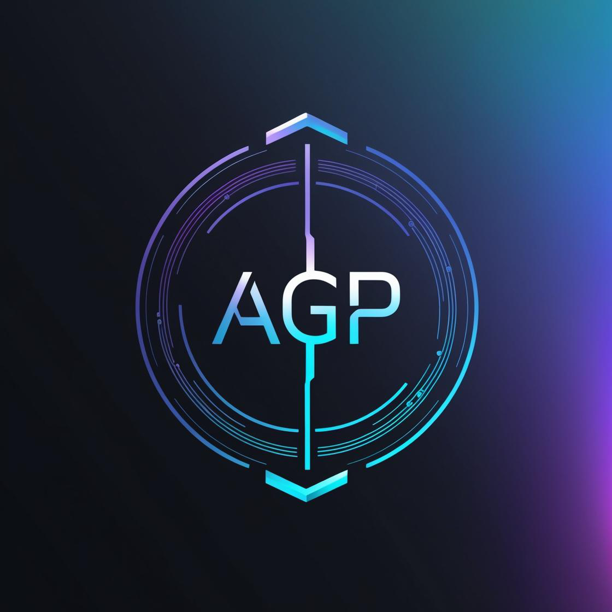

# 🤖 Agent Genesis Protocol (AGP)



Agent Genesis Protocol (AGP) is a cutting-edge AI framework powered by Sentient + Fireworks stack that enables the creation and management of intelligent AI agents with emotional awareness and dynamic capabilities.

## ✨ Key Features

- ✅ **No-code AI Agent Creation**: Build custom AI agents through an intuitive interface without writing code
- 💰 **Reputation & Rewards System**: Open monetization through a comprehensive reputation tracking system
- 🤝 **Multi-Agent Collaboration**: Agents can work together and share information
- 🛠️ **Modular Skills**: Powered by Dobby-Unhinged LLaMA 3 70B for advanced capabilities
- 🔄 **Seamless Deployment**: Easy deployment via Render platform
- 🧠 **Sentient Chat UI Integration**: User-friendly interface for interacting with agents
- 😊 **Emotional Intelligence**: Built-in emotion analysis for more human-like interactions
- 📚 **Memory System**: Agents can remember past interactions and learn from them

## 🔧 Tech Stack

- **Backend**: Python + Flask
- **AI Model**: Fireworks API (`dobby-unhinged-llama-3-3-70b-new`)
- **Framework**: Sentient Agent Framework
- **Deployment**: Render
- **Version Control**: GitHub
- **Database**: SQLite for agent memory

## 🚀 Live Project

🌐 [Visit AGP on Render](https://agent-genesis-protocol.onrender.com)

## 🛠️ Installation & Setup

### Prerequisites

- Python 3.8 or higher
- Fireworks API key

### Installation Steps

1. Clone the repository:
   ```bash
   git clone https://github.com/yourusername/Agent-Genesis-Protocol-AGP-.git
   cd Agent-Genesis-Protocol-AGP-
   ```

2. Install dependencies:
   ```bash
   pip install -r requirements.txt
   ```

3. Create a `.env` file in the root directory with your Fireworks API key:
   ```
   FIREWORKS_API_KEY=your_fireworks_api_key
   ```

4. Run the application:
   ```bash
   python main.py
   ```

5. Open your browser and navigate to `http://localhost:5000`

## 📂 Project Structure

```
├── agents/                  # Agent data and configurations
│   ├── agent_panchu_v1/     # Version 1 agent data
│   ├── agent_panchu_v2/     # Version 2 agent data
│   ├── emotion_history.json # Emotion tracking data
│   └── registry.json        # Agent registry
├── static/                  # Static assets
│   └── LOGO.png             # AGP logo
├── templates/               # HTML templates
│   ├── builder.html         # Agent builder interface
│   ├── dashboard.html       # Admin dashboard
│   ├── index.html           # Main landing page
│   └── test_dashboard.html  # Testing dashboard
├── .env                     # Environment variables
├── agent_config.json        # Agent configuration
├── agent_memory.db          # Agent memory database
├── agent_traits.json        # Agent personality traits
├── emotion_analyzer.py      # Emotion analysis module
├── main.py                  # Main application file
├── README.md                # Project documentation
├── render.yaml              # Render deployment configuration
├── reputation.json          # Reputation tracking data
└── requirements.txt         # Python dependencies
```

## 📦 Skills & Capabilities

AGP supports unlimited AI skills dynamically using LLaMA 3 through the Fireworks API. Agents can:

- Process and understand natural language
- Analyze emotions in text
- Remember past interactions
- Adapt responses based on personality traits
- Collaborate with other agents
- Learn and improve over time

## 🧠 Emotion Analysis

AGP includes a sophisticated emotion analysis system that can detect various emotions in text, including:

- Joy
- Sadness
- Anger
- Fear
- Surprise
- Confusion
- Neutral

This enables more human-like and emotionally intelligent interactions with users.

## 🤝 Contributing

Contributions are welcome! If you'd like to contribute to AGP, please:

1. Fork the repository
2. Create a new branch for your feature
3. Add your changes
4. Submit a pull request

## 📞 Contact

Want to build your own agent or integrate AGP into your workflow? [Contact us](mailto:agentgenesisai@gmail.com)

## 📄 License

This project is licensed under the MIT License - see the LICENSE file for details.

---

© 2025 Agent Genesis Protocol
